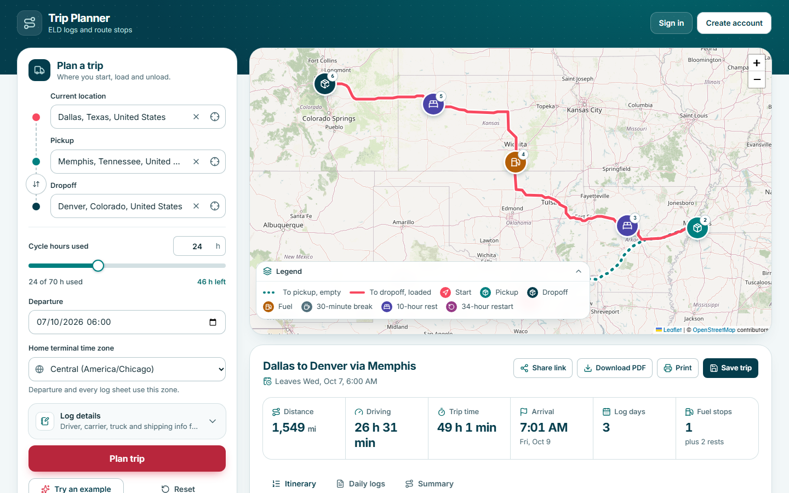
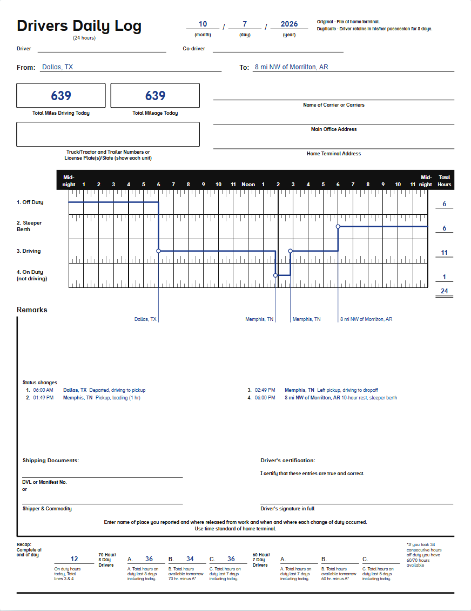
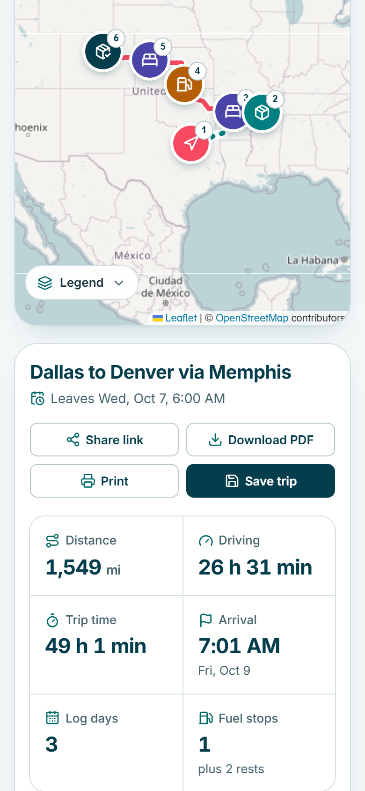
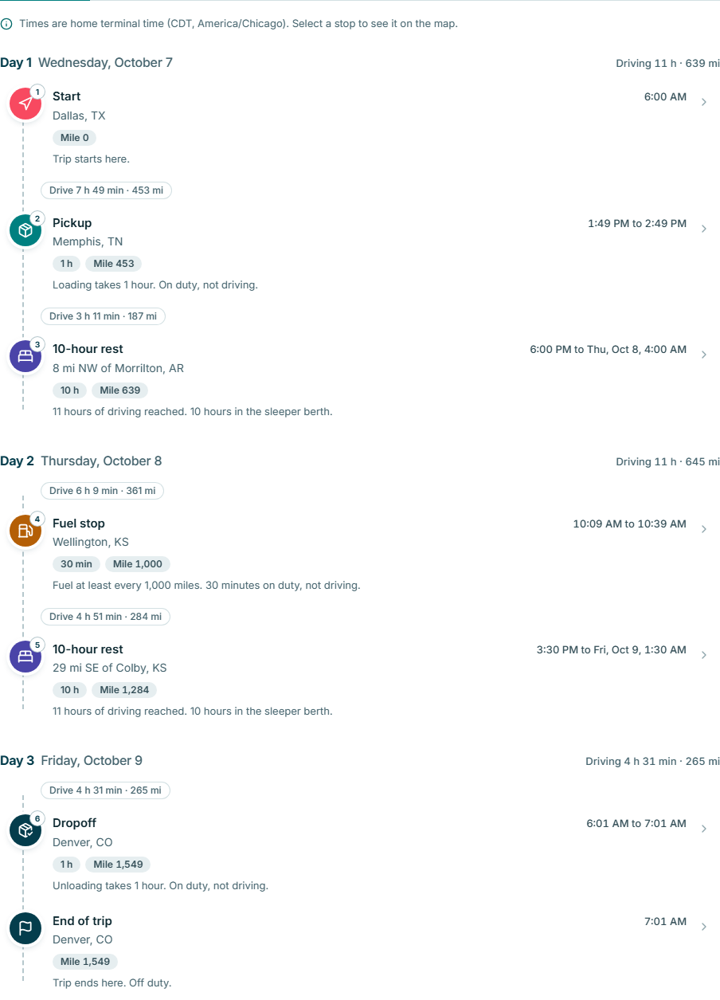
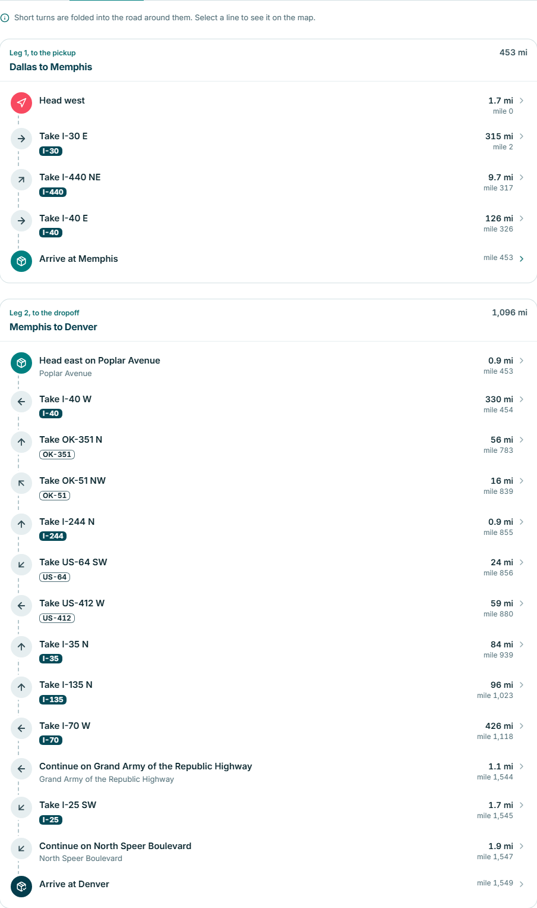

# ELD trip planner

Give it a current location, a pickup, a dropoff and the hours you've already used in your 70-hour cycle. It plans the drive, adds the fuel stops, breaks and rests the rules require, draws the route on a map, and fills out one daily log sheet for every day of the trip.

It's built for a property-carrying driver on the 70-hour/8-day schedule, with Django on the back and React on the front.

**Live site:** https://test-spotter-fullstack.vercel.app

Press **Try an example** to plan Dallas to Memphis to Denver with 24 hours already used.



<p>
  
  
</p>

<p>
  
  
</p>

## What it does

- Takes three places (type to search, or click the map) and the hours already used in the cycle, from 0 to 70.
- Routes the trip with OSRM and drives it through an hours-of-service simulation, one minute at a time.
- Inserts fuel stops (30 minutes on duty, at least every 1,000 miles), 30-minute breaks, 10-hour sleeper rests, and a 34-hour restart when the cycle runs out.
- Shows the route on an OpenStreetMap map with numbered stops, a legend and a popup per stop.
- Lists the trip day by day: arrival and departure times, durations and mile markers.
- Gives road-by-road directions for both legs, merged by road so a 1,500-mile trip reads as about 40 lines ("Take I-40 W, 212 mi"). A line pans the map to that spot.
- Draws a daily log sheet for every day, rebuilt as SVG to match the paper form: status line, remarks, totals, the 70-hour recap and the driver's certification line.
- Downloads all the sheets as one PDF, or prints them one per page.
- Shares a trip as a link. Opening it plans the trip again, with no account needed.
- Lets you save trips, rename them and open them later, once you've made an account.

## Quickstart

You need Python 3.12 or newer and Node 22 or newer.

The fast way starts Django on port 8000 and the app on port 5173, and sets everything up on the first run:

```powershell
.\scripts\dev.ps1
```

```bash
./scripts/dev.sh
```

Open http://127.0.0.1:5173. The scripts run Django with `DJANGO_DEBUG=1`, so there's no secret key to set. Ctrl+C stops both servers.

The same thing by hand, from the repository root:

```powershell
# Backend
python -m venv backend\.venv
backend\.venv\Scripts\python.exe -m pip install -r requirements.txt -r backend\requirements-dev.txt
cd backend
$env:DJANGO_DEBUG = "1"
.\.venv\Scripts\python.exe manage.py migrate
.\.venv\Scripts\python.exe manage.py createcachetable
.\.venv\Scripts\python.exe manage.py runserver

# Frontend, in a second terminal
cd frontend
npm ci
npm run dev
```

On macOS and Linux use `backend/.venv/bin/python` and `export DJANGO_DEBUG=1`.

`createcachetable` makes the table that backs request throttling. Skip it and the API still answers, but it can't count requests.

The app uses public OpenStreetMap services (OSRM for routes, Photon for search, Nominatim for map clicks). No API keys are involved. Settings for pointing at other servers live in [DEPLOY.md](DEPLOY.md).

## How the hours-of-service logic works

The planner follows the FMCSA rules for a property-carrying driver. It walks the trip in whole minutes: drive to the pickup, one hour on duty, drive to the dropoff, one hour on duty. Before each stretch of driving it asks how far the driver can go before something runs out:

| Limit | Value | What happens when it's reached |
|---|---|---|
| Driving | 11 hours after 10 hours off | 10 hours in the sleeper berth |
| Window | 14 hours from coming on duty | 10 hours in the sleeper berth |
| Break | 8 hours of driving | 30 minutes off duty |
| Cycle | 70 hours on duty in 8 days | 34 hours off duty, then the cycle starts at 0 |
| Fuel | 1,000 miles | 30 minutes on duty, not driving |

Whichever limit comes first ends the stretch. When two arrive at the same minute, fuel goes first, then the restart, then the rest, then the break. Work that isn't driving can run past the window or past 70 hours. Only driving is capped.

Each day's sheet is cut at midnight in the home terminal's time zone, so the four status totals always add up to 24 hours. [docs/hos-rules.md](docs/hos-rules.md) has every rule, the tie-break order and the recap math.

Plans are checked two ways. The engine has its own tests, including a checker written from scratch that validates many random trips. The end-to-end suite then re-checks plans coming out of the live API with a second, separate referee. Neither shares code with the engine.

## Assumptions

These come from the assessment, and the app prints them with every plan:

- Property-carrying driver on the 70-hour/8-day schedule. No adverse driving conditions.
- Fuel at least once every 1,000 miles. Pickup and dropoff take 1 hour each, logged On Duty (not driving).
- The driver starts rested, with a full tank, and the 14-hour window starts at departure.
- Hours already used never drop out of the 8-day window during the trip. It's the cautious reading, since the app only knows one number.
- Drive time is the slower of OSRM's estimate and distance at 60 mph. OSRM uses a car profile, so it runs fast for a truck.
- Overnight rest is logged in the sleeper berth. The 34-hour restart is logged Off Duty.
- No split sleeper pairing, no short-haul exception, no personal conveyance.
- The log uses the home terminal's time zone at the moment of departure and keeps that offset for the whole trip.

## Stack

| Part | Choice |
|---|---|
| Backend | Django 5.2, Django REST framework, SQLite locally and Postgres (Neon) in production |
| Frontend | React 19, TypeScript, Vite, Tailwind CSS v4, TanStack Query, Leaflet with react-leaflet |
| Log sheets | SVG built in React, PDF through jsPDF and svg2pdf.js |
| Places | OSRM (routes), Photon (search), Nominatim (map clicks), bundled GeoNames towns for log remarks |
| Hosting | One Vercel project: static frontend plus Django as a Python function behind `/api` |
| Tests | pytest, Hypothesis, Vitest, Playwright with axe-core, GitHub Actions |

The design choices are explained in [docs/architecture.md](docs/architecture.md).

## API

Everything is JSON under `/api`. Errors share one shape. [docs/api-contract.md](docs/api-contract.md) has the details.

| Method and path | What it does |
|---|---|
| `GET /api/health` | Liveness check |
| `GET /api/geocode/search` | Place typeahead |
| `GET /api/geocode/reverse` | Names a point picked on the map |
| `POST /api/plan` | Plans a trip: route, stops, segments, daily logs |
| `GET /api/auth/csrf` | Sets the CSRF cookie |
| `GET /api/auth/me` | The signed-in user, or `null` |
| `POST /api/auth/register`, `login`, `logout` | Account and session |
| `GET`, `POST /api/trips` | List and save trips |
| `GET`, `PATCH`, `DELETE /api/trips/<id>` | Open, rename and delete one trip |

Planning, geocoding and PDF export work without an account. Saving needs one.

Interactive docs: [`openapi.yaml`](openapi.yaml) opens in any OpenAPI viewer, and [`requests.http`](requests.http) is a ready-to-run request collection for VS Code or JetBrains. Every error uses one shape, listed in [ERROR-CONTRACT.md](ERROR-CONTRACT.md).

## Security

- Accounts use Django sessions: HttpOnly, `SameSite=Lax` and `Secure` cookies, with CSRF checked on every unsafe request, including sign-in and sign-up.
- Passwords go through Django's validators and PBKDF2. Sign-in says "Email or password is incorrect" for either mistake.
- A saved trip belongs to one user. Anyone else gets a 404, for read, rename and delete alike.
- Every input is validated on the server (ranges, lengths, time zone names). Request bodies are capped at 64 KB.
- Outside calls go only to hosts set in the settings, with timeouts and size caps. No user text becomes part of a URL path.
- Throttling per client address, shared across serverless instances through the database cache.
- The planner stores nothing client-supplied: saving a trip plans it again on the server.
- The browser app never renders API text as HTML, and the content security policy allows scripts from the same origin only.
- CI scans for secrets, vulnerable dependencies and code issues. [docs/testing.md](docs/testing.md) lists the security tests.

## Scripts

| Where | Command | What it does |
|---|---|---|
| `backend/` | `python -m pytest` | All backend tests |
| `backend/` | `python -m ruff check .` and `ruff format --check .` | Lint and format check |
| `frontend/` | `npm run dev` | App on port 5173, `/api` proxied to Django |
| `frontend/` | `npm run build` | Typecheck and production build |
| `frontend/` | `npm run lint`, `npm run typecheck`, `npm test` | Lint, types, unit tests |
| `frontend/` | `npm run test:e2e` | Playwright suite |
| repo root | `scripts/dev.ps1`, `scripts/dev.sh` | Django and Vite together |

## Deploy

One Vercel project. The steps, the environment variables and the fixes for common failures are in [DEPLOY.md](DEPLOY.md).

## Tests

```powershell
# Backend: unit, API, security, and the engine's compliance checker
cd backend
.\.venv\Scripts\python.exe -m pytest

# Frontend: lint, types, unit tests, build
cd frontend
npm run lint; npm run typecheck; npm test; npm run build

# End to end: starts a fake OSRM/Photon/Nominatim, Django and Vite, then drives Chromium
cd frontend
npx playwright install chromium
npx playwright test
```

[docs/testing.md](docs/testing.md) covers every suite, the environment variables, the fake upstream and how to run the same specs against a deployed site.

## Project layout

```
api/            Vercel entry point for Django
backend/        Django project
  apps/planner/   Hours-of-service engine, route providers, plan endpoint
  apps/accounts/  Email and password accounts
  apps/trips/     Saved trips
  tests/          pytest suites
frontend/       React app
  src/features/   trip-form, map, results, logs, auth, trips
  e2e/            Playwright specs, helpers and the fake upstream
docs/           Architecture, HOS rules, API contract, testing
scripts/        dev.ps1 and dev.sh
.github/        CI, security scans, migration workflow, Dependabot
AGENTS.md  CLAUDE.md  DESIGN.md  specs.md  CHANGELOG.md   Project conventions and contract
DEPLOY.md  ERROR-CONTRACT.md  openapi.yaml  requests.http  API and deploy docs
```

## Credits

- Map data and tiles: &copy; [OpenStreetMap](https://www.openstreetmap.org/copyright) contributors, under the ODbL. The app shows the attribution on every map.
- Routes: [OSRM](https://project-osrm.org/) public demo server.
- Place search: [Photon](https://photon.komoot.io/) by Komoot. Reverse lookups: [Nominatim](https://nominatim.org/).
- Town names in the log remarks: [GeoNames](https://www.geonames.org/) `cities5000`, licensed [CC BY 4.0](https://creativecommons.org/licenses/by/4.0/). The trimmed copy and its notice are in `backend/apps/planner/gazetteer/`.
- Rules: FMCSA, *Interstate Truck Driver's Guide to Hours of Service* (2022), 49 CFR Part 395.
- Typeface: Inter, through [Fontsource](https://fontsource.org/), under the SIL Open Font License.

The public OSRM, Photon and Nominatim servers are shared demo services with usage limits. For real traffic, run your own or use a paid provider and point the `*_BASE_URL` settings at it.

## License

[MIT](LICENSE). Copyright (c) 2026 rodsimonc.
