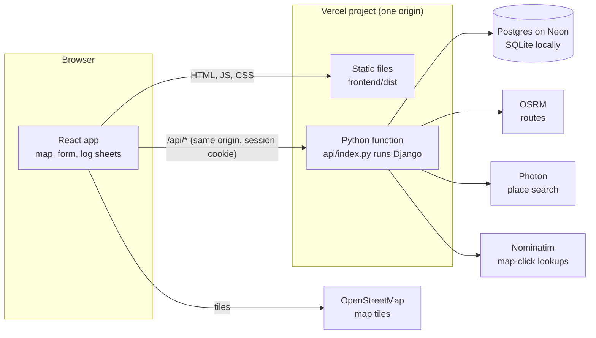
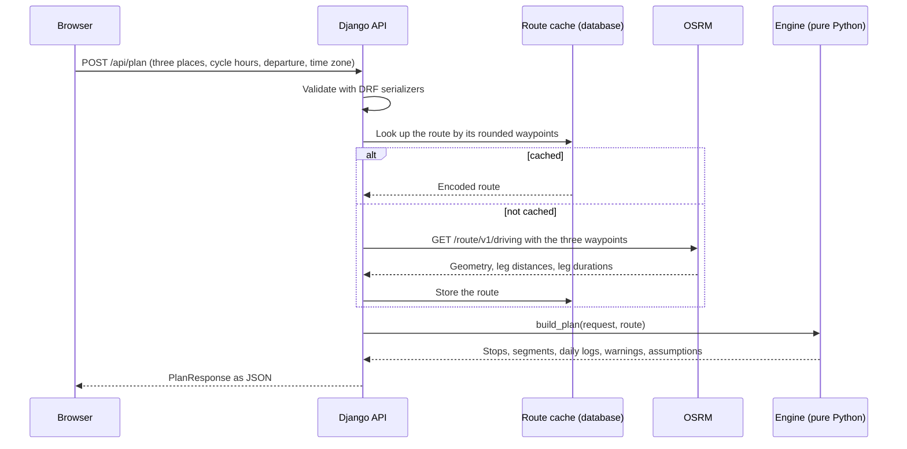
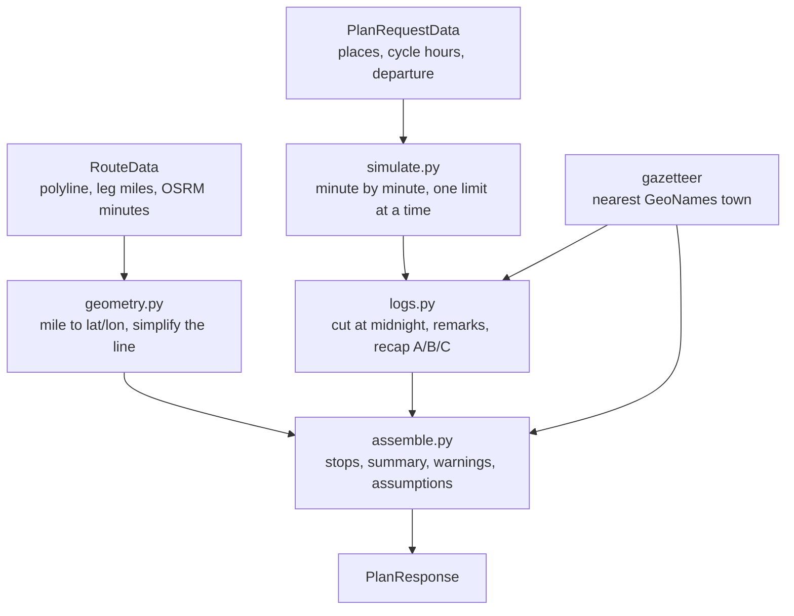
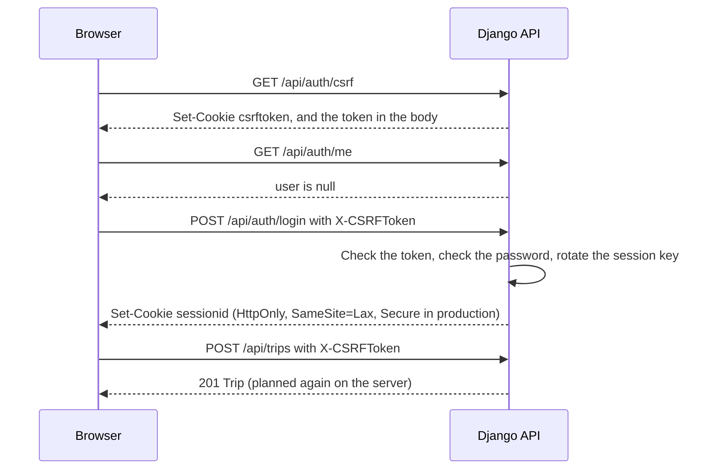
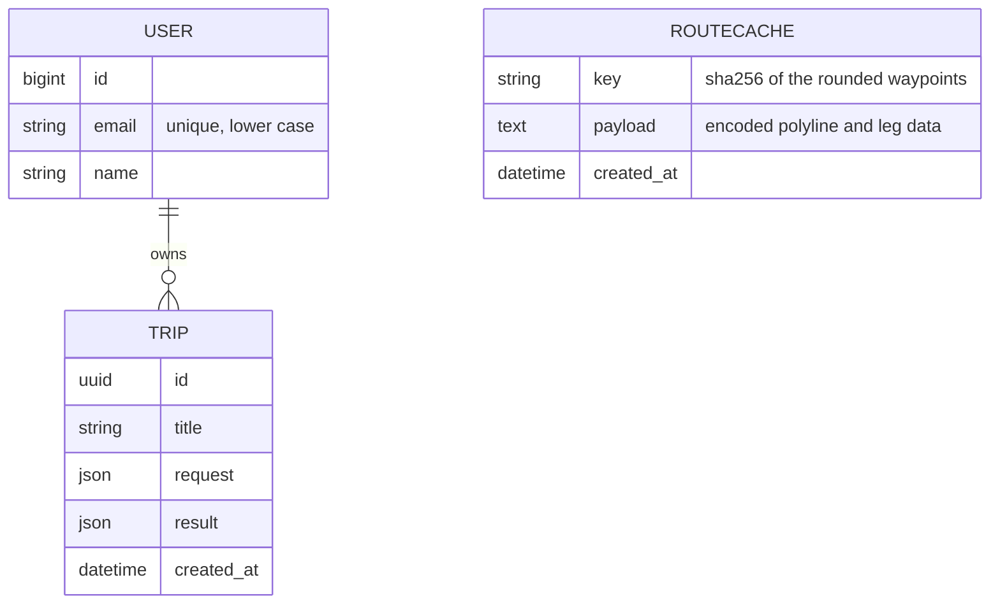

# Architecture

One repository, one Vercel project, one origin. The React app is a static build. Django runs as a Python function behind `/api`. A Postgres database holds accounts, saved trips and cached routes.

## The pieces



The browser never talks to OSRM, Photon or Nominatim. Django does, with a short timeout, one retry, a size cap on every response and a fixed list of hosts that comes from settings. The only third party the page contacts is the OpenStreetMap tile server, and the content security policy allows its tile hosts for images and nothing else off-site.

## Planning a trip

`POST /api/plan` is the request that matters most.



The engine takes plain data and returns plain data. It has no network access and doesn't import Django, so its tests run without a database or a mock server.

Inside the engine:



Drive time for each leg is the larger of OSRM's estimate and distance at 60 mph. OSRM models a car, and a loaded truck is slower. [hos-rules.md](hos-rules.md) has the rule book the simulation follows.

## Sessions and CSRF



Accounts use Django's session auth and password validators. There's no token in local storage for a script to steal. Saving a trip sends only the request. The server plans it again and stores its own result, so a client can't plant a plan.

## Data



`RouteCache` has no link to a user. The same route is useful to everyone, and it keeps repeat plans (including the save that follows a plan) off the public OSRM server.

## The front end

```
src/
  api/          typed client, endpoint functions, TanStack Query hooks, types.ts
  components/   ui (button, field, modal, tabs, toast) and layout (header, footer)
  features/
    trip-form/  place combobox, cycle and departure fields, validation
    map/        Leaflet map, stop markers, legend, pick-on-map mode
    results/    stats, itinerary, summary, action row, loading and error states
    logs/       the SVG log sheet, the viewer, PDF export, print
    auth/       dialog and account menu
    trips/      My trips drawer
  lib/          share links, time zones, formatting
```

Server state (the session, saved trips, place search) lives in TanStack Query. The plan itself sits in component state, because it's the result of one action and isn't cached. `src/api/types.ts` and [api-contract.md](api-contract.md) describe the same shapes, and the Python side mirrors them.

## Why these choices

| Choice | Why |
|---|---|
| Django and DRF | The brief asks for Django. DRF gives validation, throttling and one error format with little code. |
| Django on Vercel as a function | One deploy, one origin, and no CORS to get wrong. Cookies stay `SameSite=Lax`. |
| Postgres through `DATABASE_URL` | Function disks are read-only and short-lived. SQLite is the default only for local work. |
| Session cookies, not JWT | The browser stores the session as HttpOnly. CSRF protection comes with Django. |
| Throttle counters in the database cache | Each function instance is separate, so in-memory counters would count nothing useful. |
| OSRM, Photon, Nominatim | Free, no keys, and the assessment asks for a free map API. All three are behind Django, so swapping one is a settings change. |
| Bundled GeoNames towns for log remarks | A log sheet needs a town for every status change. Looking each one up live would be slow and would run into usage limits. |
| Engine as pure functions | Easy to test hard, and the numbers can't depend on a network. |
| Minute resolution, integer minutes | No floating point drift in totals that must add up to 1,440. |
| One fixed UTC offset per trip | Every sheet is exactly 24 hours, even across a clock change. A warning covers the two nights a year that matters. |
| Log sheets as SVG | The PDF stays vector and the sheet scales to any width. It works offline, with no font or image to fetch. |
| Share link carries the request, not an ID | Anyone can open it without an account, and nothing is stored. |
| Fake upstream for the end-to-end suite | The tests need routes and place names to be repeatable and need failures on demand. A real server gives neither. |

## Limits worth knowing

- The public OSRM, Photon and Nominatim servers are demo services. They throttle, and they can be slow or down. The API turns that into a 502 with a readable message and keeps the form as it was.
- OSRM routes for a car. Roads closed to trucks, low bridges and weight limits aren't known to it.
- The cycle is a single number. The app can't see which of the last 8 days the hours came from, so it assumes none of them drop out during the trip.
